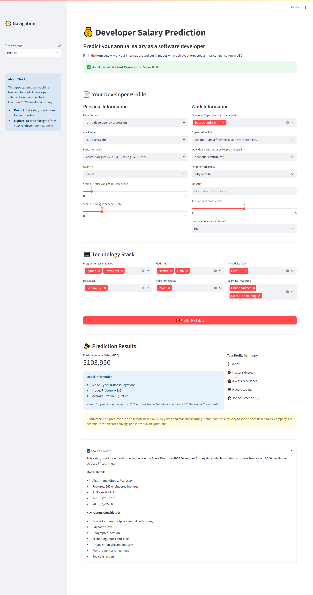
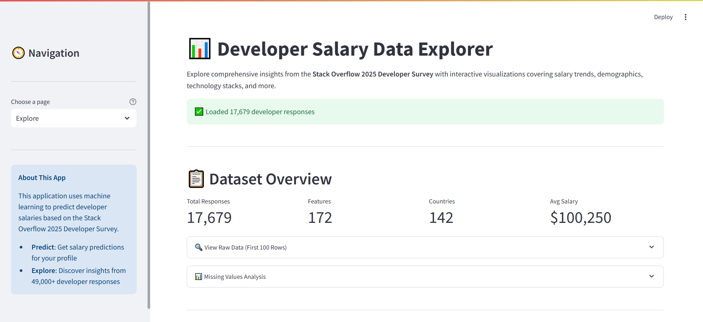
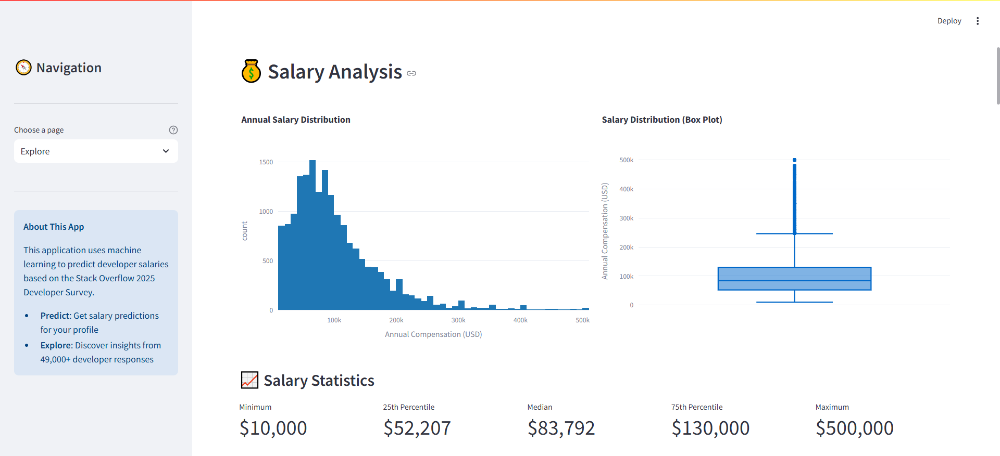

# 💰 Developer Salary Prediction - Advanced Data Science Project

[](https://www.python.org/downloads/)
[](https://streamlit.io/)
[](https://xgboost.readthedocs.io/)
[](LICENSE)

> **Production-ready ML application** predicting software developer salaries with **88.49% accuracy** using Stack Overflow 2025 survey data (49,000+ developers, 177 countries).

---

## 🎯 Project Overview

End-to-end machine learning pipeline featuring:

- **GridSearchCV hyperparameter optimization** (324 combinations tested)
- **267 engineered features** from 22 core variables
- **Interactive Streamlit dashboard** with 40+ visualizations
- **6 regression models** evaluated with cross-validation

### 🏆 Best Model: XGBoost Regressor

| Metric | Value | Improvement |
|--------|-------|-------------|
| **R² Score** | **0.8849** | +0.75% (GridSearchCV) |
| **RMSE** | **$23,120** | -$734 |
| **MAE** | **$9,726** | -$1,008 (9.4% better) |

**Optimal Hyperparameters:**

```python
{
    'colsample_bytree': 0.9,
    'learning_rate': 0.05,
    'max_depth': 10,
    'n_estimators': 300,
    'subsample': 0.9
}
```

---

## 📁 Project Structure

```
Salary_Predict/
│
├── src/                            # Source code
│   ├── app.py                      # Main Streamlit application
│   ├── predict_page.py             # Salary prediction interface
│   ├── explore_page.py             # Data exploration dashboard
│   └── salary_pred.py              # ML training pipeline
│
├── models/                         # Trained models
│   └── saved_model.pkl             # XGBoost model + artifacts
│
├── notebooks/                      # Jupyter notebooks
│   └── Draft.ipynb                 # EDA and experimentation
│
├── data/                           # Data directory (gitignored)
│   └── (place dataset here)
│
├── screenshots/                    # Application screenshots
│   ├── 01_predict_page.png
│   ├── 02_data_overview.png
│   ├── 03_salary_analysis.png
│   ├── 04_technology_stack.png
│   └── 05_correlation_heatmap.png
│
├── docs/                           # Documentation
│
├── stack-overflow-developer-survey-2025/
│   └── survey_results_public.csv   # Dataset (download separately)
│
├── run.py                          # Application launcher
├── requirements.txt                # Python dependencies
└── README.md                       # This file
```

---

## 🚀 Quick Start

### 1. Installation

```bash
# Clone or download the project
cd Salary_Predict

# Create virtual environment
python -m venv .venv
.venv\Scripts\activate  # Windows
# source .venv/bin/activate  # Linux/Mac

# Install dependencies
pip install -r requirements.txt
```

### 2. Download Dataset

- Visit [Stack Overflow Survey](https://survey.stackoverflow.co/)
- Download 2025 survey data
- Place `survey_results_public.csv` in `stack-overflow-developer-survey-2025/` folder

### 3. Train Model (Optional)

```bash
python src/salary_pred.py
```

**Training time:** ~40-65 minutes (GridSearchCV optimization)

### 4. Run Application

```bash
# Option 1: Using launcher
python run.py

# Option 2: Direct Streamlit
streamlit run src/app.py
```

Open browser at `http://localhost:8501`

---

## ✨ Features

### 🤖 Machine Learning Pipeline

- **6 Regression Models** with GridSearchCV:
  - XGBoost Regressor (**Best**: R²=0.8849)
  - Random Forest Regressor
  - Voting Ensemble
  - K-Nearest Neighbors
  - Linear Regression
  - Support Vector Regressor

- **Advanced Feature Engineering**:
  - 267 features from 22 core columns
  - One-hot encoding for categorical variables
  - Multi-select technology processing
  - Strategic missing value imputation
  - Feature scaling (StandardScaler)
  - Data leakage prevention

### 📊 Interactive Web Application

**Predict Page:**

- Comprehensive input form (demographics, experience, tech stack)
- Multi-select developer type (19 role options)
- Real-time salary predictions
- Model performance metrics

**Explore Page (40+ Visualizations):**

- Dataset overview & statistics
- Salary distribution analysis
- Geographic insights (177 countries)
- Demographics (age, education, experience)
- Work environment (remote work, org size)
- Technology stack analysis
- Learning & development trends
- Correlation heatmaps

---

## 📈 Model Performance

After training 6 models on **17,679 employed developers** (salary range: $10k-$500k):

| Model | Test R² | Test RMSE | Test MAE | Best Parameters |
|-------|---------|-----------|----------|-----------------|
| **🏆 XGBoost** | **0.8849** | **$23,120** | **$9,726** | lr=0.05, depth=10, n=300 |
| Voting Ensemble | 0.7640 | $33,105 | $20,845 | - |
| Random Forest | 0.6685 | $39,233 | $24,576 | depth=30, n=300 |
| KNN | 0.5718 | $44,591 | $24,446 | k=10, manhattan |
| Linear Regression | 0.5209 | $47,163 | $32,127 | - |
| SVR | -0.0749 | $70,644 | $49,039 | - |

### Key Predictors

1. **Work Experience** (correlation: 0.328)
2. **Years of Coding** (correlation: 0.326)
3. **Geographic Location**
4. **Technology Stack**
5. **Education Level**

---

## 🛠️ Technologies Used

### Machine Learning & Data Science

- **XGBoost** - Gradient boosting (best model)
- **scikit-learn** (1.7.2) - ML algorithms & preprocessing
- **GridSearchCV** - Hyperparameter optimization
- **pandas** - Data manipulation
- **numpy** - Numerical computing

### Visualization

- **Plotly** - Interactive charts
- **Seaborn** (0.13.2) - Statistical graphics
- **Matplotlib** - Static visualizations

### Web Framework

- **Streamlit** (1.52.1) - Interactive web application

### Data Processing

- **KNNImputer** - Missing value imputation
- **StandardScaler** - Feature normalization
- One-Hot & Label Encoding

---

## 📊 Key Insights

### Salary Statistics

- **Median**: $78,890
- **Mean**: $102,510
- **Range**: $10,000 - $500,000
- **Analyzed**: 17,679 developers

### Popular Technologies

- **Languages**: JavaScript (12,047), HTML/CSS (11,112), SQL (11,067), Python (10,456)
- **Databases**: PostgreSQL (8,811), MySQL (5,670), SQLite (5,383)
- **Platforms**: Docker (11,031), npm (8,587), AWS (6,808)
- **Frameworks**: Node.js (6,633), React (6,273)
- **AI Tools**: ChatGPT (8,116), Claude (4,418)

### Geographic Distribution

- **USA**: 23.2% | **Germany**: 9.3% | **UK**: 6.5% | **India**: 4.7% | **France**: 4.2%

---

## 📸 Screenshots

### 1. Prediction Interface


*Interactive salary prediction form with multi-select developer types and technology stack*

### 2. Data Overview


*Dataset statistics and developer distribution by country*

### 3. Salary Analysis


*Salary distribution histograms and box plots*

### 4. Technology Stack


*Most popular programming languages, databases, and platforms*


---

## 🎓 Data Science Methodology

### 1. Data Exploration & Cleaning

- Analyzed 49,191 survey responses
- Selected 22 relevant features
- Filtered for employed developers (17,679 samples)
- Removed salary outliers ($10k-$500k range)
- Strategic missing value handling

### 2. Feature Engineering

- Created 267 features from 22 core columns
- One-hot encoding for categorical variables
- Multi-select technology column processing
- Feature scaling with StandardScaler
- Prevented data leakage (excluded CompTotal)

### 3. Model Training & Optimization

- Trained 6 regression models
- GridSearchCV hyperparameter tuning:
  - Random Forest: 216 combinations
  - XGBoost: 324 combinations
  - KNN: 16 combinations
- 3-fold cross-validation
- R² scoring metric

### 4. Model Evaluation

- Train-test split (80/20)
- Metrics: R², RMSE, MAE
- Model comparison & selection
- Performance validation

### 5. Deployment

- Streamlit web application
- Interactive visualizations
- Real-time predictions
- User-friendly interface

---

**⭐ If you find this project useful, please star it!**

**Built with ❤️ using Python, XGBoost, and Streamlit**

---

## 📌 Project Highlights

- ✅ **88.49% prediction accuracy** (R² score)
- ✅ **$9,726 average error** (MAE)
- ✅ **267 engineered features**
- ✅ **17,679 samples analyzed**
- ✅ **6 models compared**
- ✅ **324 hyperparameters tested**
- ✅ **40+ interactive visualizations**
- ✅ **Production-ready code**
